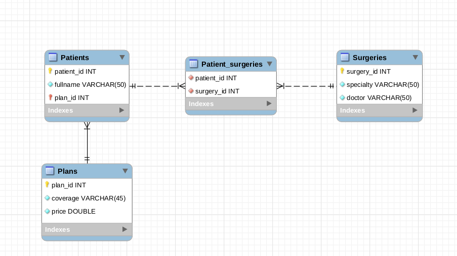

# :pencil: ORM - Associations N:N e Transactions

Os requisitos dos exercícios são:

Nesse exercício vamos criar uma API que será responsável pela gestão de um sistema de saúde. Nesse sistema terão pacientes, cada um com seu plano. Cada paciente pode ter realizado várias cirurgias, que por sua vez, devem ser listadas e categorizadas. O diagrama abaixo demonstra como o banco de dados se comportará:

### 🚀 Exercício 1

Crie o model de `Plans`.

### 🚀 Exercício 2

Crie o model de `Patients`.

### 🚀 Exercício 3

Crie o model de `Surgeries`.

### 🚀 Exercício 4

Crie o model de `PatientSurgeries`.

### 🚀 Exercício 5

Crie um endpoint que liste todos os pacientes e seus respectivos planos.

### 🚀 Exercício 6

Crie um endpoint que liste todos os pacientes e suas respectivas cirurgias realizadas.

### 🚀 Exercício 7

Crie um endpoint que de acordo com o id de um plano, que deve ser recebido via requisição, liste os pacientes que o possuem.

## Bônus

### 🚀 Exercício bônus 1

Crie um endpoint capaz de adicionar um novo paciente.

### 🚀 Exercício bônus 2

Crie um endpoint que liste todos os pacientes e suas cirurgias realizadas, mas oculte o nome do médico responsável.

### 🚀 Exercício bônus 3

Crie um endpoint que de acordo com o nome do médico, que deve ser recebido via requisição, liste todas as cirurgias realizadas pelo mesmo, um get na url `http://localhost:3000/surgeries/Rey%20Dos%20Santos`deve retornar as cirurgias realizadas pelo médico `Rey Dos Santos`.
